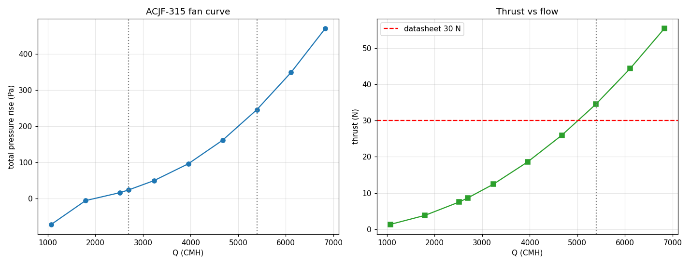

# ACJF-315 Axial Jet Fan — Virtual Performance Testing

**OpenFOAM 12** virtual fan testing of the ACJF-315 axial jet fan using a resolved-blade MRF (Moving Reference Frame) approach, producing a full fan curve and thrust-vs-flow characterisation across 10 operating points.

> **Headline result:** the CFD model predicts the fan meets the datasheet 30 N thrust at Q ≈ 5,400 CMH, with the curve shape and operating range consistent with the manufacturer specification.

---

## Objective

To predict the ACJF-315's performance from blade geometry alone — pressure rise vs flow rate (fan curve) and thrust vs flow rate — using a resolved-blade MRF simulation. Results were shared with AC Humidin for quality assessment against the 30 N datasheet thrust.

---

## Model

| Parameter | Value |
|---|---|
| Fan | ACJF-315 axial jet fan |
| Approach | Resolved-blade MRF (Moving Reference Frame) |
| Mesh | ~1.25 M cells, blockMesh annular domain + snappyHexMesh blades |
| Cell zone | Rotating MRF zone enclosing the full blade |
| Solver | `foamRun -solver incompressibleFluid` |
| Turbulence | k-ε (standard) |
| Operating points | 10 (Q = 0.30 – 1.90 m³/s, inlet velocity 0.43 – 2.71 m/s) |

---

## Results



**Figure 1.** Left: ACJF-315 fan curve — total pressure rise (Pa) vs volume flow rate (CMH). Right: thrust (N) vs flow rate, with the datasheet 30 N reference. The CFD model crosses the 30 N thrust line at Q ≈ 5,400 CMH. The curve shape is physically consistent: pressure rise and thrust both increase with flow rate in the tested range.

**Table 1.** Operating point sweep results.

| OP | Inlet velocity (m/s) | Q actual (m³/s) | Q (CMH) | Pressure (Pa) |
|---|---|---|---|---|
| OP01 | 0.428 | 0.299 | 1,077 | −51.8 |
| OP02 | 0.713 | 0.499 | 1,796 | +15.9 |
| OP03 | 0.998 | 0.698 | 2,513 | +53.6 |
| OP04 | 1.069 | 0.748 | 2,693 | +65.6 |
| OP05 | 1.283 | 0.898 | 3,233 | +107 |
| OP06 | 1.568 | 1.100 | 3,960 | +179 |
| OP07 | 1.854 | 1.300 | 4,680 | +272 |
| OP08 | 2.139 | 1.500 | 5,400 | +388 |
| OP09 | 2.424 | 1.700 | 6,120 | +526 |
| OP10 | 2.708 | 1.899 | 6,836 | +685 |

The negative pressure at OP01 (low flow) is physically expected — the fan is operating near or below its self-priming point at very low throughflow.

---

## Meshing stack

```
Python blade loft → gmsh remesh → blockMesh 360° annular →
snappyHexMesh (blunt trailing edge + 1mm tip clearance) →
topoSet rotor cellZone → foamRun incompressibleFluid
```

**What works:**
- Rotating walls use `MRFnoSlip` (not standard `noSlip`)
- `omega` entered as explicit rad/s with **negative sign** for a pressure-adding fan
- MRF zone encloses the complete blade geometry

**What to avoid:**
- cfMesh on twisted blades (hangs on complex geometry)
- Boundary layers in snappyHexMesh on lofted STL (skew → GAMG crashes)
- Long 10D straight duct (friction decay corrupts the fan curve)
- Periodic 1/4-sector meshing (cyclic BC face-count mismatch)

---

## Two fan-modelling methods — when to use each

| Method | When | Notes |
|---|---|---|
| **Resolved-blade MRF** *(this project)* | Predicting performance FROM blade geometry | RAM-heavy, geometry-sensitive, correct for fan characterisation |
| **Momentum/thrust source** | Studying fan's *effect* on a space (tunnels, car parks) | Robust, first-try success — correct choice for most paid ventilation work |

This project uses Method A (resolved-blade) because the objective is performance prediction from geometry. All car park and tunnel projects use Method B.

---

## Repository contents

```
05-acjf315-fan-testing/
├── README.md
├── methodology/
│   └── mrf_setup.md          MRF zone, omega convention, wall BC notes
├── scripts/
│   └── run_sweep.sh          inlet velocity sweep across 10 operating points
└── results/
    ├── sweep_results.csv     raw operating point data (Q, pressure, inlet velocity)
    └── figures/
        └── fan_curve.png     fan curve + thrust vs flow vs datasheet
```

---

*Tools: OpenFOAM 12 · snappyHexMesh · MRF · gmsh · k-ε turbulence · Python (post-processing).*
